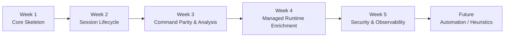

# PRD Hub

Central product documentation hub for `mcp-windbg-dotnet`.

## Index
- Product Requirements Doc Template: `_template-prd.md`
- Feature Spec Template: `_template-feature-spec.md`
- Acceptance Checklist Template: `_template-acceptance-checklist.md`
- Decision Log: `decision-log/`
- Backlog: `backlog/`
- Metrics: `metrics/`
- Release Plan: `release-plan/`
- Risk Register: `risk-register.md`

## Conventions
- All dates ISO 8601 (YYYY-MM-DD)
- ADR filenames: `ADR-XXXX-title.md` (incrementing zero-padded)
- Status values: Draft | Proposed | Accepted | Deprecated | Superseded
- PRD version format: `vMajor.Minor` (e.g. v1.0)

## Authoring Flow
1. Start with `_template-prd.md` duplicated & renamed.
2. Break out detailed feature(s) into separate feature spec(s).
3. Capture decisions as ADRs.
4. Add backlog items referencing the PRD ID.
5. Update metrics & release plan as scope solidifies.
6. Maintain risk register.

## Implementation Order & Dependencies
The following implementation sequence breaks work into weekly, independently shippable increments:

| Order | Week | PRD ID | Focus | Key Deliverables | Depends On |
|-------|------|--------|-------|------------------|------------|
| 1 | 1 | PRD-core-skeleton | Project scaffolding & MCP bootstrap | .NET solution, health tool, config | - |
| 2 | 2 | PRD-session-lifecycle | CDB session wrapper & lifecycle mgmt | `CdbSession`, repository, idle eviction | 1 |
| 3 | 3 | PRD-command-parity | Core analysis parity & allowlisted commands | open/analyze/run/list/close tools | 1,2 |
| 4 | 4 | PRD-managed-enrichment | Managed (.NET) enrichment via CLRMD | `analyze_managed_context` tool | 3 |
| 5 | 5 | PRD-security-observability | Policy, metrics, rate limiting, redaction | Policy engine, stats tools | 2,3 |
| 6 | Future | (TBD) Automation / heuristics | Crash classification, summarization | Heuristic pipeline | 3,4,5 |

### Mermaid Diagram

### Notes
- Parallelization: Portions of security telemetry (metrics counters) can start in Week 3 if resources allow.
- Feature flags recommended for Weeks 4–5 to de-risk rollout.
- Each week ends with acceptance checklist completion and ADR updates if scope diverges.

_Last Updated: 2025-09-19_
